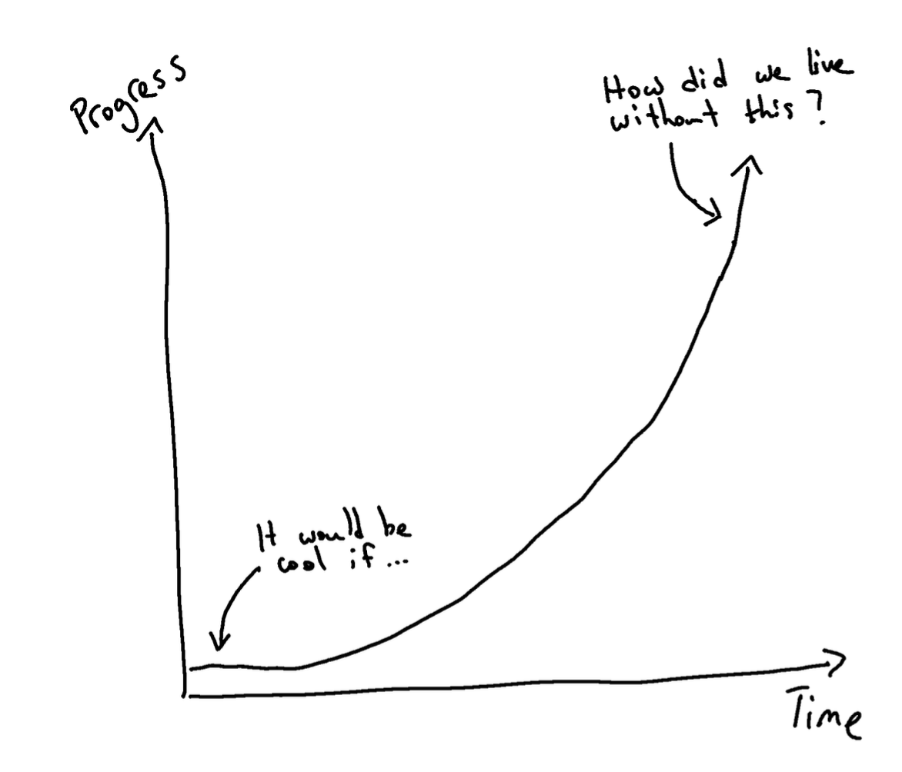
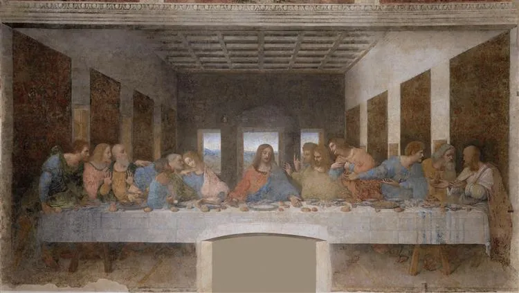
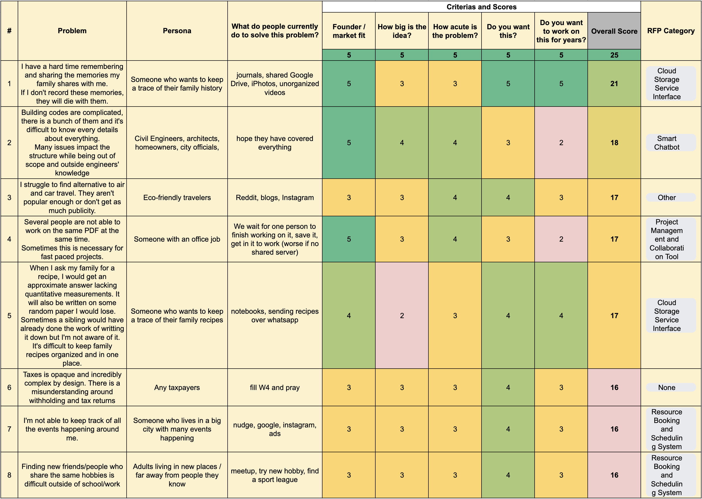
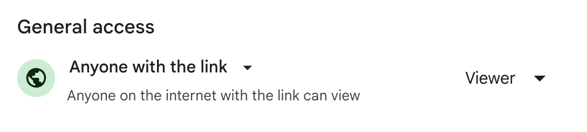

# Noticing a Project Idea

[Video](https://youtu.be/meNvup0lX0U)

<!-- INTRO -->
Ideas are the foundation for innovative software development. In this lesson, we'll explore how to generate ideas organically to solve real problems for real people.

> "...everything around you that you call life was made up by people no smarter than you"
>
> [Steve Jobs](https://www.youtube.com/watch?v=kYfNvmF0Bqw)

Innovation often comes from observing the world around you, identifying problems, and finding potential solutions.

<!-- "notice" rather than "think up" ideas. -->
> The verb you want to be using with respect to startup ideas is not "think up" but "notice." We call ideas that grow naturally out of the founders' own experiences "organic" startup ideas. The most successful startups almost all begin this way.
>
> [Paul Graham](https://paulgraham.com/startupideas.html)

<!-- Focus on the future -->
<!-- focusing on the future rather than what's already been done. -->

<!-- exponential line graph with y-axis progress and x-axis time starting with "It would be cool if..." and ending with "How did we live without this?" -->

> "Skate to where the puck is going, not where it has been."
> Wayne Gretzky

## You exist in the context of all that came before you

Just as the Grand Canyon was formed over millions of years through gradual, often accidental forces of nature, our world is shaped by time, momentum, and experiences. These forces create deep channels of thought and perception, reinforcing our understanding of reality.

Many innovations arise from simply looking at the world differently. By stepping back and observing how systems evolve, you can spot opportunities for innovation that others might miss. To notice new ideas, we must look beyond the immediate and seek higher viewpoints, understanding that our surroundings and ideas are shaped by cumulative experiences over time.

## Old Is New Again
Many new/innovative ideas are actually just new takes on really old ideas that arise from looking at the world differently.

### Airbnb
For millennia, travelers stayed with locals in inns, guesthouses, or private homes. In ancient Greece and Rome, hospitality was considered a sacred duty, and many households welcomed travelers. Even during medieval times, monasteries provided lodging to pilgrims, and throughout history, travelers often paid to stay in private homes.

### Uber
The concept of paying for a ride dates back to horse-drawn carriages, or "hackney carriages," which were regulated in London as early as the 17th century. By the 19th century, horse-drawn "cabs" had evolved into motorized taxis, with the first taxi meters being introduced in 1897 in Germany.

### Amazon
Before the advent of the internet, mail-order catalogs and physical retail stores were the primary means for consumers to purchase goods.

### Craigslist
Classified advertising has long been a staple in newspapers and local publications, serving as a platform for job listings, housing, for-sale items, and services. This traditional model was well-established by the time the internet began to proliferate.

### Spotify
Music distribution dates back to live performances, but the invention of the phonograph in the late 19th century allowed music to be recorded and sold in physical formats, such as records, tapes, and eventually CDs. Radio (early 20th century) brought music to mass audiences for free, supported by advertisements.

## Am I an Innovator?
What is the most important trait for building a new idea?
- IQ?
- Knowledge?
- Skills?
- Something else???

Leonardo Da Vinci (1452–1519) had vast contributions to art, science, engineering, anatomy, and more! You probably know Da Vinci for his paintings like the "Mona Lisa" and "Last Supper".

Da Vinci's designs and concepts in engineering were far ahead of his time.

Da Vinci must of had a lot of *inteligence* in order to create, but raw brainpower alone isn't enough. Beyond raw intellectual horsepower, Da Vinci must have picked up the *knowledge and technical skills* to paint, sketch, and design his works. Today those skills might be coding, engineering, or design. Knowing how to do something doesn't guarantee insight into what should be done. Having a *point of view* is what turns ideas into reality. The combination of your unique perspective, experiences, skills, and intelligence produce the best ideas.

## Point of View as a Superpower
Having a unique point of view allows you to build something that others might not see. It’s the combination of your life experiences, skills, and insights that enable you to notice what others overlook.

- **Look for New Combinations**: Innovation often comes from combining existing ideas in new ways. Consider how current technologies can intersect to create something novel.
- **Recognize Patterns**: Pay attention to how different systems work and evolve. Understanding these patterns can help you predict future needs and challenges.
- **Stay Curious**: Ask questions about the world around you. Curiosity drives exploration and can lead to valuable insights.
- **Help Yourself and Others**: Can you think of ways you can use technology to help automate the drudgery out of your life?

<!-- TODO: strong pov

- **Elon Musk**: Views technology as the key to solving humanity's greatest challenges, like space colonization and sustainable energy.
- **Steve Jobs**: Believed technology should be intuitive and beautifully designed, revolutionizing the consumer tech world.
- **Judy Faulkner**: Focused on healthcare technology, improving patient care through innovative health records management.

-->

<!-- How to evaluate project ideas -->
## When considering an idea, ask yourself the following:

### Are you the right person to solve this?
Think about your previous experiences and work. Do you have unique insight or expertise in this area? You may be uniquely suited to identify, understand, and solve a problem better than anyone else. 

<!-- TODO: previous projects that mapped to a trainee experience -->
#### Trainee Examples
Past trainees have leveraged their life and work experience to build something new:

- Jose worked as a branch clerk for Chase Bank. He noticed that customers often didn't realize many of the benefits of using credit cards, which inspired his final project [CreditSmart](https://www.loom.com/share/9ed1e5dcbe444bea8707ee711b89cb10?t=163&sid=3e61f441-a32d-42bd-a4f4-8fff7fb31f4e).
- Fidel worked as a piano teacher. He felt the pain points of updating students and parents on their progress and planning his schedule, which inspired [LessonLinx](https://www.youtube.com/watch?v=Olk2nNJjJrE).
- Natalie worked in Quality Assurance for a manufacturing company. She felt the pain of documenting quality checks as parts moved through the factory, which inspired [QualiTrackr](https://drive.google.com/file/d/11vamruKx7hbhW9HG6cjFht3TnMhDZ9kL/view).
- Adolfo worked part time in his family's Dry Cleaning Company. He noticed the pain points his parents encountered tracking orders, taking payments, and notifying customers when orders were completed, which inspired [Valenti Cleaners POS](https://drive.google.com/file/d/14o2SCTNXT1xVQYdEoc8PJMBIIT9oCd9F/view)
- ...and more on [rfp.dpi.dev](https://rfp.dpi.dev)

<!-- TODO
- jp (gym scheduling)
- sam (climbing)
- reza (er admin)
-->

### How big is the market?
Do a lot of people have this problem? (More is usually better) Either a lot of people have the problem **OR** a few people are willing to pay a lot to solve it.

<!-- pricing -->
<!-- difficuly in finding users / customers -->

### How acute is the problem?
Is this problem really painful and/or annoying? How often do people encounter this problem? (more often is usually better)

<!-- eg uber: I need to get places multiple times a day -->
<!-- buying a house: once a lifetime maybe? -->

### Do you have competition?
Competition can be a good sign! It shows that others are also working to solve the problem, validating its significance. (It could also mean it's a [tarpit idea](https://www.ycombinator.com/library/Ij-tarpit-ideas-what-are-tarpit-ideas-how-to-avoid-them))

### Did this recently become possible or necessary?
Has something about the world changed recently? (New technology, law, problem, etc.)

### Do you want this?
You'll already have a first user... you! Are there a lot of other people like you? You should be your own first customer. If it solves a problem for you, it's likely to solve it for others.

### Is this an idea you'd want to work on for years?
Are you passionate about this problem? Do you have a personal connection? Do you like your user?

### Is this a good idea space?
A good idea space has a lot of people with this problem willing to try your solution (and pay for it) Your first version will probably be wrong/bad. You will learn a lot by building, deploying and getting feedback from users. If you're in a good idea space (with a high potential for success) you can iterate towards the optimal solution. Check out our [Requests for Projects page](https://rfp.dpi.dev) for some good idea spaces

Generally, building something you find interesting or in a field you have an expertise or insight is a good start!

### More questions to consider

- What are you good at?
- Is there a problem you've personally encountered you can build a solution for?
- Is there something you just wish existed?
- Is there something about the world that has changed recently that has created an opportunity?
- Go out and talk to people!
- Is there a big industry that seems broken?

<!-- TODO: add quiz questions -->

Remember, we're just building projects to build out your portfolio, learn and get better at our craft.

## Assignment: Propose Project Ideas
I recommend you start writing down ideas you notice organically and rank them on these key questions.
Focus on the **problem** / **pain point** you plan to address. Solutions are easier to change than problems.

Identify 3-5 problems or pain points you may want to address. We want to make sure you have at lest considered a few problems before building any solutions. Use the questions from this lesson to evaluate your ideas. Submit your proposals in a spreadsheet format, answering key evaluation questions such as market size, problem frequency, your unique insight into the problem, etc. Don't hesitate to reach out for a 1on1 with an instructor, TA, or fellow trainee and talk through what you are thinking.

[Example template: Project Idea Evaluation Template](https://docs.google.com/spreadsheets/d/1jrgdMMt33lIGqXTEu8vE2fwLjoMkzyJAPlZuKLihvuQ/edit#gid=0)

Please create a spreadsheet using [Google Sheets](https://sheets.google.com) and share your url. It should be something like this: `docs.google.com/spreadsheets/<...>`. Make sure anyone with the link can view.

- Enter your `docs.google.com/spreadsheets` shared URL:
- `docs.google.com/spreadsheets/d/id/edit?usp=sharing`
  - Great job!
- any
  - Not quite. Make sure the URL looks like: `docs.google.com/spreadsheets`
{: .free_text #project_ideas_spreadsheet title="Project Ideas Spreadsheet URL" points="1" answer="1" }

After you submit the URL here, return to Canvas and submit the URL again in the assignment "Noticing a Project Idea: Spreadsheet". I recommend booking time with an instructor or TA to get more feedback on your ideas.

---

# Sources
- [Steve Jobs: Secrets of Life](https://www.youtube.com/watch?v=kYfNvmF0Bqw)
- [Alan Kay: How to invent the future](https://www.youtube.com/watch?v=1e8VZlPBx_0)
- [YCombinator: How to Get and Evaluate Startup Ideas](https://www.youtube.com/watch?v=Th8JoIan4dg)
- [Paul Graham: How to get startup ideas](https://paulgraham.com/startupideas.html)
- [Requests for Projects](https://rfp.dpi.dev/)

---

- Approximately how long (in minutes) did this lesson take you to complete?
{: .free_text_number #time_taken title="Time taken" points="1" answer="any" }
